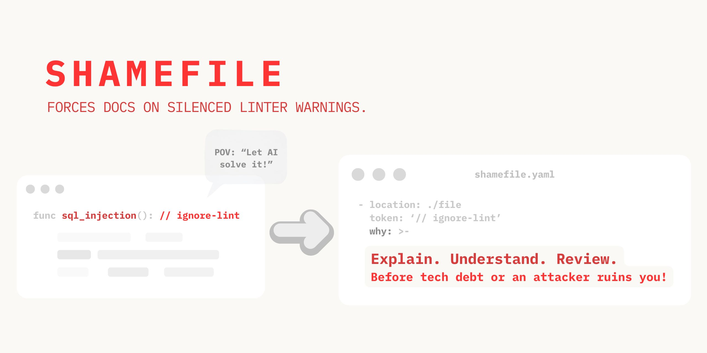
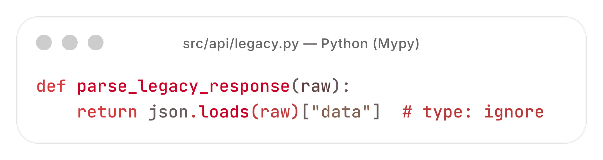
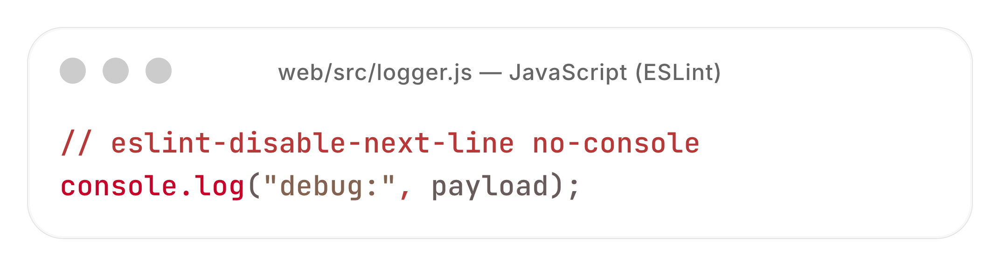
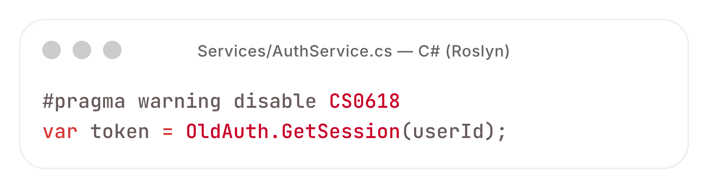
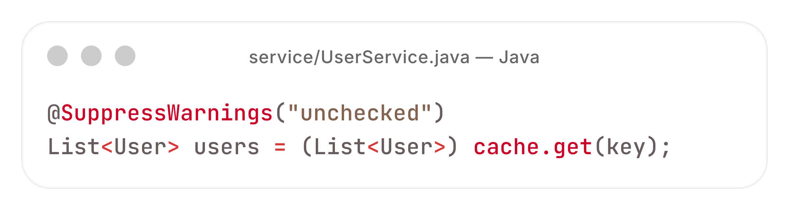
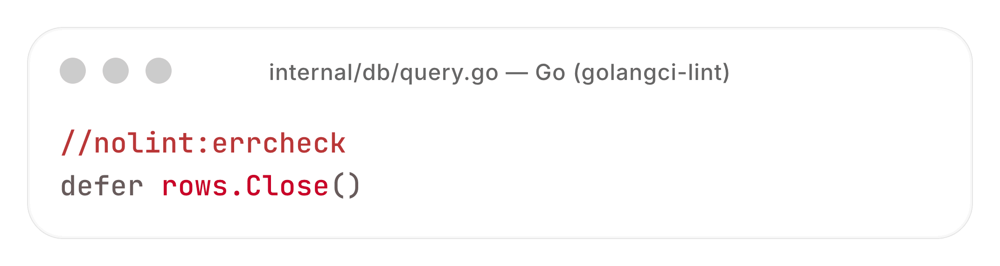
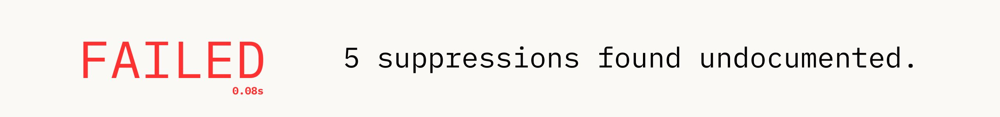
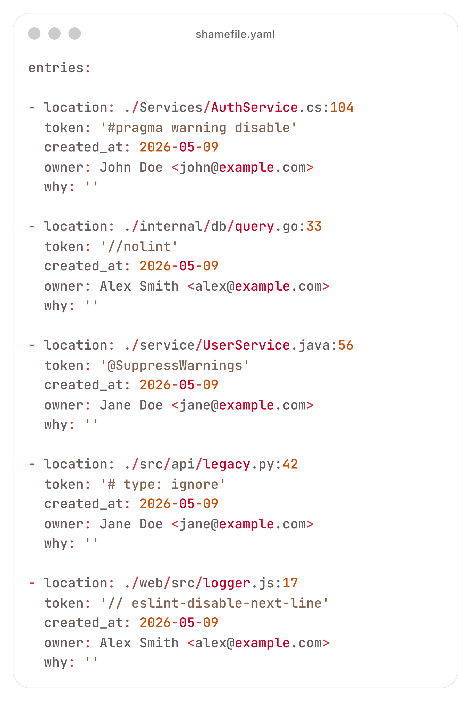
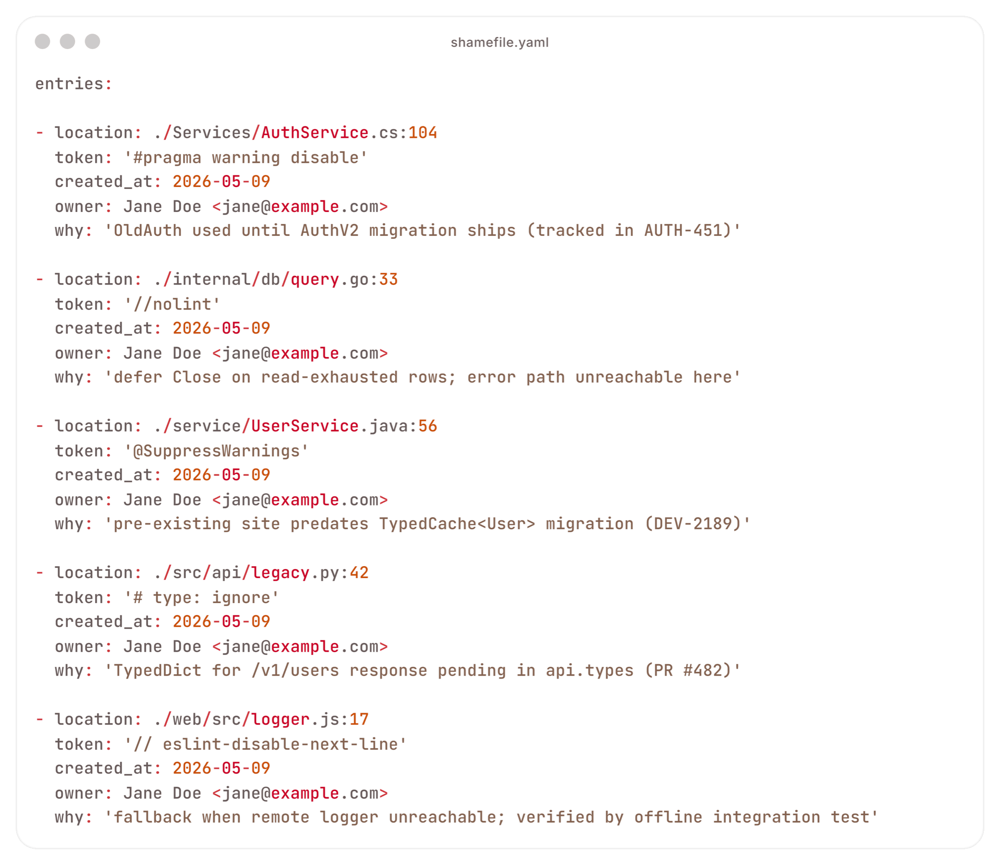
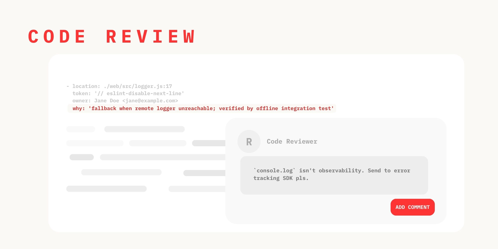

<p align="center">
  
</p>


&nbsp;

**Turn silent tech debt into reviewable and documented decisions.**

[](https://github.com/BKDDFS/shamefile/actions/workflows/test.yml)
[](https://github.com/BKDDFS/shamefile/actions/workflows/lint.yml)
[](https://github.com/BKDDFS/shamefile/actions/workflows/codeql.yml)
[](https://sonarcloud.io/summary/new_code?id=BKDDFS_shamefile)
[](https://sonarcloud.io/summary/new_code?id=BKDDFS_shamefile)
[](https://opensource.org/licenses/Apache-2.0)
[](https://www.rust-lang.org/)
[](https://github.com/BKDDFS/shamefile)

<br clear="left">

<p align="center">
  <a href="#how-it-works">How it works</a> &nbsp;&bull;&nbsp;
  <a href="#why-you-should-use-it">Why use it</a> &nbsp;&bull;&nbsp;
  <a href="#installation">Installation</a> &nbsp;&bull;&nbsp;
  <a href="#supported-languages">Supported languages</a> &nbsp;&bull;&nbsp;
  <a href="#faq">FAQ</a> &nbsp;&bull;&nbsp;
  <a href="#roadmap">Roadmap</a> &nbsp;&bull;&nbsp;
  <a href="#contributing">Contributing</a>
</p>

**shamefile** won't let anyone silence a linter warning in your code without writing down why.

People are lazy. Both committer and code reviewer.

- The **committer** slaps a `// NOLINT` comment when there's no easy fix. They don't justify it — in most languages there's no good place for that.
- The **code reviewer** focuses on more important things: security, bugs, design. There's no dedicated time for checking new suppression arrivals.

Shamefile adds `shamefile.yaml` for the code reviewer and the `shame` CLI for the committer to give them tools to react before tech debt gets out of control.

## How it works

### We have 5 demo files with code:

<p align="center">
  
  
</p>
<p align="center">
  
  
</p>
<p align="center">
  
</p>


### Init empty shamefile with `shame me .`

<p align="center">
  
</p>


<p align="center">
  
</p>


### Fill empty `why` with `shame next`

<p align="center">
  
</p>

### Run again via CI with `shame me . --dry-run`

<p align="center">
  
</p>

<p align="center">
  
</p>

<p align="center">
  
</p>

## Why you should use it

<br>


### Instantly improves AI agents
<sub>Ignoring warnings? Not so easy anymore. Triggers AI reflection — "is this really unfixable?". Observed across Claude, GPT, and Cursor agents. Safer vibe coding by default.</sub>

<br clear="left">

<br>


### Single source of truth
<sub>"Where to document?", "where to look?", "what to do?" — same answer to every question: `shamefile.yaml`.</sub>
<br><br>
<br clear="right">

<br>


### Reviewable by design
<sub>Make suppression review a ritual, not goodwill.</sub>
<br><br>
<br clear="left">

<br>


### Shamefile doesn't quit with ex-employees
<sub>Knowledge stays in the YAML and you can refactor with confidence.</sub>
<br><br>
<br clear="all">

## Installation

| Source | Command |
|---|---|
| **npm** | `npm install -g shamefile` |
| **PyPI** | `pip install shamefile` |
| **crates.io** | `cargo install shamefile` |
| **From source** | `cargo install --git https://github.com/BKDDFS/shamefile` |
| **Homebrew** | _coming soon_ |

All channels install the `shame` CLI. Run `shame --help` to verify.

Or as a [pre-commit](https://pre-commit.com) hook:

```yaml
# .pre-commit-config.yaml
- repo: https://github.com/BKDDFS/shamefile
  rev: main
  hooks:
    - id: shamefile
```

## Commands

| Command | What it does |
|---|---|
| `shame me .` | Scan project, sync `shamefile.yaml`; fail if any entry lacks `why` |
| `shame me . --dry-run` | CI mode — read-only validation, never writes to disk |
| `shame next` | Show first undocumented entry with the source line highlighted |
| `shame next "<reason>"` | Document the first undocumented entry inline |
| `shame fix <location> <token> --why "<reason>"` | Document a specific entry |
| `shame remove <location> <token>` (alias `shame rm`) | Delete a stale entry without editing the YAML by hand |

Run `shame --help` for the full reference.

## CI/CD integration

On the CI side, `shame me . --dry-run` is read-only and deterministic. It validates three contracts:

| Check | Meaning |
|---|---|
| Coverage | Every suppression in code is registered in `shamefile.yaml` |
| Staleness | Every registered entry still points at a live suppression in code |
| Justification | Every entry has a non-empty `why` |

A failure on any of the three exits non-zero.

```yaml
# .github/workflows/ci.yml
- name: Check suppressions
  run: shame me . --dry-run
```

| Flag | Description |
|---|---|
| `--dry-run` (`-n`) | Read-only validation for CI/CD — never writes to disk |
| `--hidden` | Also scan hidden files and directories (dotfiles) |

## Registry format

`shamefile.yaml` lives at the project root (git root if available, otherwise the working directory). Every entry is human-readable and stable under `git diff`:

```yaml
---
config: {}
entries:

- location: ./src/api.py:42
  token: '# type: ignore'
  content: 'result = parse_legacy_api(raw)  # type: ignore'
  created_at: 2026-04-17
  owner: Anna Nowak <anna@example.com>
  why: 'legacy API returns untyped dict; types module in progress'
```

- `location` and `token` form the entry's identity.
- `content` is the verbatim source line — used for reconciliation when code moves.
- `owner` and `created_at` are populated automatically on first run via `git blame`.
- `why` is the only field that requires a written justification — from a developer or an AI agent. The PR reviewer decides whether the reason is good enough.

## Cascade matching

A registry that breaks every time you refactor is worse than no registry. `shamefile` reconciles entries against source code in two passes:

1. **Location match** — exact `file:line` + token.
2. **Content match** — same source line + token (handles line shifts, with rename detection limited to the most recent commit via `git diff HEAD~1..HEAD -M`).

Reformatting a function or inserting imports above a suppression preserves the entry — `owner`, `created_at`, and `why` stay intact. Entries are only removed when the token itself is gone from the code.

## Supported languages

| Token | Tool | Language |
|---|---|---|
| `# noqa` | Flake8 / Ruff | Python |
| `# pylint: disable` | Pylint | Python |
| `# type: ignore` | Mypy | Python |
| `# pyright: ignore` | Pyright | Python |
| `# pytype: disable` | Pytype | Python |
| `# pyre-ignore` / `# pyre-fixme` | Pyre | Python |
| `nosec` | Bandit | Python |
| `# pragma: no cover` | Coverage.py | Python |
| `# fmt: off` / `# fmt: skip` | Black / Ruff | Python |
| `# isort: skip` | isort | Python |
| `# lint-fixme` / `# lint-ignore` | Fixit | Python |
| `# autopep8: off` | autopep8 | Python |
| `// eslint-disable`, `/* eslint-disable` | ESLint | JS / TS / TSX |
| `// tslint:disable`, `/* tslint:disable` | TSLint | TS / TSX |
| `// @ts-ignore`, `/* @ts-ignore` | TypeScript | JS / TS / TSX |
| `// @ts-expect-error`, `/* @ts-expect-error` | TypeScript | JS / TS / TSX |

Supported file extensions: `.py`, `.js`, `.jsx`, `.mjs`, `.cjs`, `.ts`, `.tsx`.

## Roadmap

- **MCP server** — native integration for LLM-based PR authors (avoids loading the full registry into agent context)
- **Custom git merge driver** — auto-resolve `shamefile.yaml` conflicts on parallel PRs
- **Additional language grammars** — Rust, Go, Java, Kotlin, C# via tree-sitter
- **Custom entry fields** — attach `ticket`, `reviewer`, or `deadline` metadata to suppressions
- **Native exclusion config** — first-class `exclude:` patterns in `shamefile.yaml` for checked-in vendored or generated code that bypasses the default `.gitignore` discovery

## FAQ

<details>
<summary><strong>Why not just write the reason inline, like <code># noqa: F401  # legacy import</code>?</strong></summary>

<br>

- **Reviewers don't see it.** A `# noqa` buried in one of seven changed files rarely gets pushback. `shamefile.yaml` puts every suppression in the PR into one diff — the reviewer sees the full cost as a single list, with author and `why` per entry.
- **Nothing forces a reason.** Linters accept any string after the token, or none. `shame me . --dry-run` fails the build until every entry has a non-empty `why`. This matters most for AI coding agents, which lose the suppression's context the moment the session ends — the registry forces them to write the reason to disk while it still exists.
- **Inline is a bad trade-off.** A short reason carries no information; a useful one drowns the line of code it is attached to. The registry keeps source readable and justifications detailed.

</details>

<br>

<details>
<summary><strong>What stops developers from writing <code>why: 'TODO'</code> and moving on?</strong></summary>

<br>

The tool guarantees a string is written; the reviewer judges whether it is a real reason. If `why: 'TODO'` passes review, that is an organisational gap, not a tool gap — but the registry makes the gap visible: every lazy entry is one `grep` away, by author and date. Before `shamefile`, the same shortcut was hidden inside whichever file it lived in.

</details>

<br>

<details>
<summary><strong>Won't <code>shamefile.yaml</code> become a merge conflict magnet on parallel PRs?</strong></summary>

<br>

This is the same trade-off every shared-file tool (lockfiles, changelogs, schema migrations) has accepted in exchange for single-source-of-truth visibility. A custom git merge driver that resolves automatically is on the Roadmap.

The registry is sorted by `(location, token)`, so suppressions added in unrelated parts of the codebase land in different regions of the file — most parallel PRs do not collide. When they do, `shame me` is idempotent: after a merge, running it on the resolved tree deterministically reconciles entries from source, so `git checkout --theirs shamefile.yaml && shame me .` is the escape hatch.

</details>

<br>

<details>
<summary><strong>What about generated, vendored, or third-party code?</strong></summary>

<br>

A repo's typical generated/vendored content is excluded for free:

- `.gitignore` and `.ignore` files are respected (handled by the same engine `ripgrep` uses), so `node_modules/`, `target/`, `dist/`, `__pycache__/` etc. are skipped without configuration.
- Only `.py / .js / .jsx / .mjs / .cjs / .ts / .tsx` are scanned, so vendored content in any other language is silently ignored.

A first-class `exclude:` config in `shamefile.yaml` is on the [Roadmap](#roadmap).

</details>

## Contributing

Contributions are welcome. Where you start depends on what you have:

- **Found a bug?** [Open an issue](https://github.com/BKDDFS/shamefile/issues/new/choose) with a minimal repro.
- **Idea or design question?** Open a [Discussion under Ideas](https://github.com/BKDDFS/shamefile/discussions/categories/ideas) so direction can be agreed before any code is written.
- **Usage question or trouble setting things up?** Ask in [Q&A](https://github.com/BKDDFS/shamefile/discussions/categories/q-a).
- **Want to send a PR?** Read [CONTRIBUTING.md](CONTRIBUTING.md) first — dev setup, build/test/lint commands, commit format.
- **Security vulnerability?** Use the private [advisory form](https://github.com/BKDDFS/shamefile/security/advisories/new) — see [SECURITY.md](SECURITY.md). **Do not** open a public issue.

By participating you agree to the [Code of Conduct](CODE_OF_CONDUCT.md).

## License

shamefile is licensed under the Apache License 2.0. See the [LICENSE](LICENSE) file for more information.
